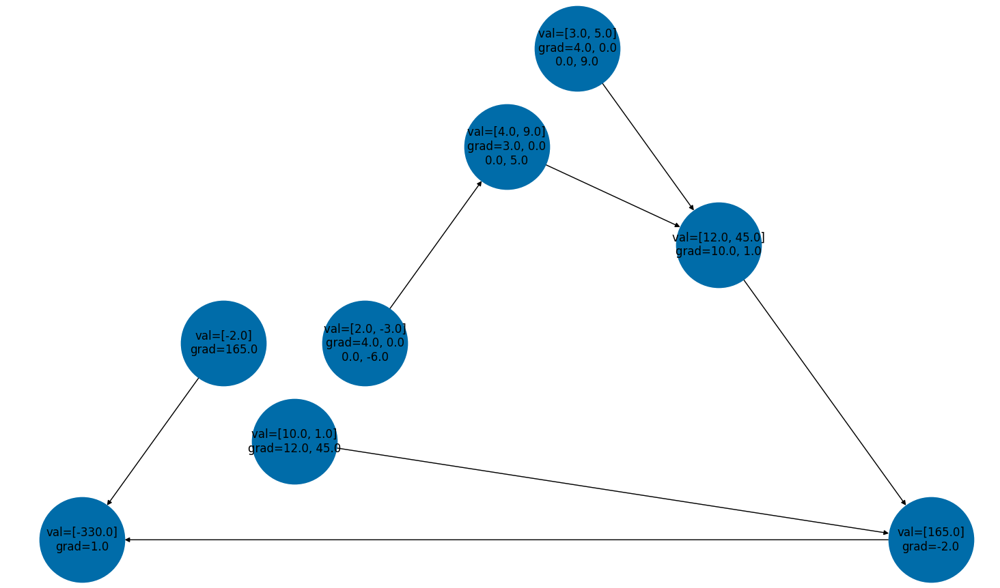

# 🔥 Ember

Ember is a lightweight statistics and ML library for my personal use with C++ and Python. 

- [Installation](#installation) 
- [Getting Started](#getting-started)
  - [Ember Tensors](#ember-tensors)
  - [Datasets](#datasets)
  - [Models and Training](#models-and-training)
  - [Monte Carlo Samplers](#monte-carlo-samplers)

## Installation

Once you git pull, copy the `pybind11` repo into `_CPP` directory. 
```
cd ember/_CPP 
git submodule add https://github.com/pybind/pybind11.git
git submodule update --init
```
Build the `_CPP` library for low level tensor operations with the following. Make sure `cmake` is installed. 
``` 
cd ember/_CPP 
mkdir build && cd build 
cmake ..
make 
```
Copy the `.so` file to `ember`. Then it is accessible by the python modules. Finally, run `pip install -e .` in the root directory to install the package. 

## Getting Started 

### Ember Tensors 

Tensors are multidimensional arrays that can be initialized in a number of ways. 
```
import ember 

a = ember.Tensor([2]) # scalar
b = ember.Tensor([1, 2, 3])  # vector 
c = ember.Tensor([[1, 2], [3, 4]]) # 2D vector 
d = ember.Tensor([[[1, 2]]]) # 3D vector
```
Gradient computations aren't supported for 3D vectors yet. Say that you have a series of elementary operations on tensors. 
```
a = ember.Tensor([2, -3]) 
h = a ** 2
b = ember.Tensor([3, 5])

c = b * h

d = ember.Tensor([10, 1])
e = c.dot(d) 

f = ember.Tensor([-2])

g = f * e
```

The C++ backend computes a directed acyclic graph (DAG) representing the operations done to compute `g`. You can then run `g.backwards()` to compute the gradients by applying the chain rule. This constructs the DAG and returns a topological sorting of its nodes. The gradients themselves, which are technically Jacobian matrices, are updated, with each mapping `x -> y` constructing a gradient tensor on `x` with value `dy/dx`. For now, the gradients are not accumulated for flexibility.  

```
top_sort = g.backprop()
print(a.grad) # [[4.0, 0.0], [0.0, -6.0]]
print(h.grad) # [[3.0, 0.0], [0.0, 5.0]]
print(b.grad) # [[4.0, 0.0], [0.0, 9.0]]
print(c.grad) # [[10.0, 1.0]]
print(d.grad) # [[12.0, 45.0]]
print(e.grad) # [[-2.0]]
print(f.grad) # [[165.0]]
print(g.grad) # [[1.0]]
```

This works for matrix multiplication as well, although in the backend the matrices are flattened and the 4-tensor is stored as a matrix. 
```
a = ember.Tensor([[1, 2, 3], [4, 5, 6]]) # 2 x 3
b =  ember.Tensor([[1, 2], [4, 8]]) # 2 x 2
c = b.matmul(a)

top_sort = c.backprop() 

pprint(a.grad)
[[1.0, 0.0, 0.0, 2.0, 0.0, 0.0],
 [0.0, 1.0, 0.0, 0.0, 2.0, 0.0],
 [4.0, 0.0, 1.0, 8.0, 0.0, 2.0],
 [0.0, 4.0, 0.0, 0.0, 8.0, 0.0],
 [0.0, 0.0, 4.0, 0.0, 0.0, 8.0],
 [0.0, 0.0, 0.0, 0.0, 0.0, 0.0]]

pprint(b.grad)
[[1.0, 4.0, 0.0, 0.0],
 [2.0, 5.0, 0.0, 0.0],
 [3.0, 6.0, 1.0, 4.0],
 [0.0, 0.0, 2.0, 5.0],
 [0.0, 0.0, 3.0, 6.0],
 [0.0, 0.0, 0.0, 0.0]]
```

Finally, we can visualize this using the `networkx` package. 



### Datasets

### Models and Training

### Monte Carlo Samplers

