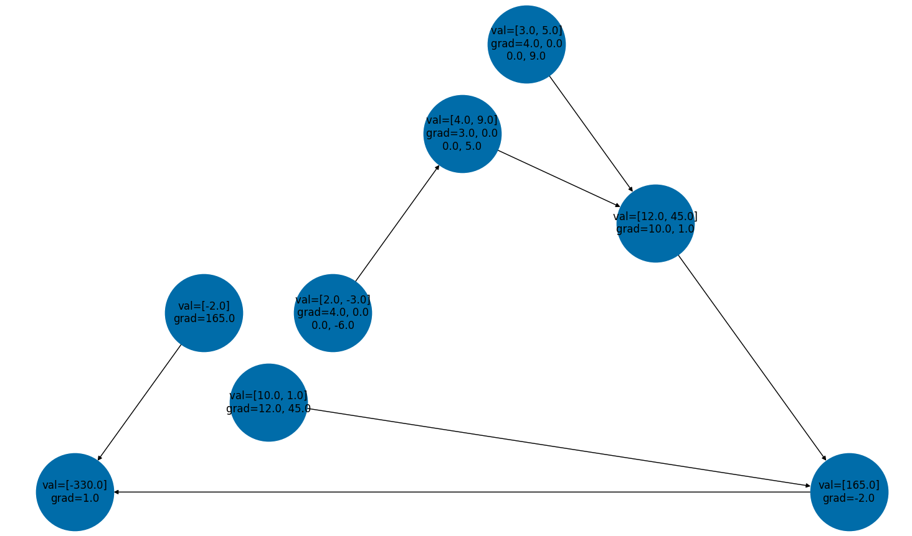

# 🔥 Ember

Ember is a lightweight statistics and ML library for my personal use with C++ and Python. 

- [Installation](#installation) 
- [Getting Started](#getting-started)
  - [Ember Tensors](#ember-tensors)
  - [Datasets](#datasets)
  - [Models and Training](#models-and-training)
  - [Monte Carlo Samplers](#monte-carlo-samplers)

## Installation

  ### Compiling the `aten` Library  

    Git clone the repo, then pip install editable, which will run `setup.py`. I've painstakingly modified the Makefiles to make the installation as portable and easy as possible. You need Python 3.12 for now. 

    ```
    git clone git@github.com:mbahng/pyember.git 
    cd pyember 
    pip install -e .
    ```
    This runs `cmake` on `CMakeLists.txt`, which calls `aten/CMakeLists.txt` that compiles and links the source files in the C++ tensor library, which in turn (by default argument `BUILD_PYTHON_BINDINGS=ON`) calls `aten/bindings/CMakeLists.txt` to further generate a `.so` file that can be imported into `ember`. If there are problems, you should first check 

    1. Whether `build/` has been created. This is the first step in `setup.py` 
    2. Whether the compiled `main.cpp` and C++ unit test files have been compiled, i.e. if `aten/main` and `aten/tests` executables exist. 
    3. Whether `build/lib*/ember/aten.cpython-3**-darwin.so` exists. The Makefile generated by `aten/bindings/CMakeLists.txt` will produce `build/aten.cpython-3**-darwin.so`, which will immediately be moved by `setup.py` to `build/lib*/ember/aten.cpython-3**-darwin.so`. 
    4. The `setup()` function will copy this `.so` file to `ember/aten.cpython-3**-darwin.so`. The `.so` file must live within `ember`, the actual library, since `ember/__init__.py` must access it within the same directory level (cannot be higher). 

  ### Making sure everything's correct 

    Run the script `run_tests.sh`, which will 
    1. Run all C++ unit tests for `aten`, ensuring that all functions work correctly. 
    2. Run all Python unit tests for `ember`, ensuring that additional functions work correctly and that the C++ functions are binded correctly. The stub (`.pyi`) files for `aten` are located in `ember/aten`. 

## Repository Structure 

  I tried to model a lot of the structure from Pytorch and TinyGrad.  

  1. `aten` contains the header and source files for the C++ low-level tensor library, such as basic operations and an autograd engine. 
  2. `docs` contains detailed documentation about each function.  
  3. `ember` contains the actual library, supporting high level models, dataloaders, and samplers. 
  4. `examples` are example scripts.  
  5. `tests` are testing modules for the `ember` library. 
  6. `CMakeLists.txt` generates the Makefiles needed to compile this library. 
  7. `setup.py` allows you to pip install this as a package. 


## Getting Started 

### Ember Tensors 

Tensors are multidimensional arrays that can be initialized in a number of ways. 
```
import ember 

a = ember.Tensor([2]) # scalar
b = ember.Tensor([1, 2, 3])  # vector 
c = ember.Tensor([[1, 2], [3, 4]]) # 2D vector 
d = ember.Tensor([[[1, 2]]]) # 3D vector
```
Gradient computations aren't supported for 3D vectors yet. Say that you have a series of elementary operations on tensors. 
```
a = ember.Tensor([2, -3]) 
h = a ** 2
b = ember.Tensor([3, 5])

c = b * h

d = ember.Tensor([10, 1])
e = c.dot(d) 

f = ember.Tensor([-2])

g = f * e
```

The C++ backend computes a directed acyclic graph (DAG) representing the operations done to compute `g`. You can then run `g.backwards()` to compute the gradients by applying the chain rule. This constructs the DAG and returns a topological sorting of its nodes. The gradients themselves, which are technically Jacobian matrices, are updated, with each mapping `x -> y` constructing a gradient tensor on `x` with value `dy/dx`. For now, the gradients are not accumulated for flexibility.  

```
top_sort = g.backprop()
print(a.grad) # [[4.0, 0.0], [0.0, -6.0]]
print(h.grad) # [[3.0, 0.0], [0.0, 5.0]]
print(b.grad) # [[4.0, 0.0], [0.0, 9.0]]
print(c.grad) # [[10.0, 1.0]]
print(d.grad) # [[12.0, 45.0]]
print(e.grad) # [[-2.0]]
print(f.grad) # [[165.0]]
print(g.grad) # [[1.0]]
```

This works for matrix multiplication as well, although in the backend the matrices are flattened and the 4-tensor is stored as a matrix. 
```
a = ember.Tensor([[1, 2, 3], [4, 5, 6]]) # 2 x 3
b =  ember.Tensor([[1, 2], [4, 8]]) # 2 x 2
c = b.matmul(a)

top_sort = c.backprop() 

pprint(a.grad)
[[1.0, 0.0, 0.0, 2.0, 0.0, 0.0],
 [0.0, 1.0, 0.0, 0.0, 2.0, 0.0],
 [4.0, 0.0, 1.0, 8.0, 0.0, 2.0],
 [0.0, 4.0, 0.0, 0.0, 8.0, 0.0],
 [0.0, 0.0, 4.0, 0.0, 0.0, 8.0],
 [0.0, 0.0, 0.0, 0.0, 0.0, 0.0]]

pprint(b.grad)
[[1.0, 4.0, 0.0, 0.0],
 [2.0, 5.0, 0.0, 0.0],
 [3.0, 6.0, 1.0, 4.0],
 [0.0, 0.0, 2.0, 5.0],
 [0.0, 0.0, 3.0, 6.0],
 [0.0, 0.0, 0.0, 0.0]]
```

Finally, we can visualize this using the `networkx` package. 



### Datasets

### Models and Training

### Monte Carlo Samplers

